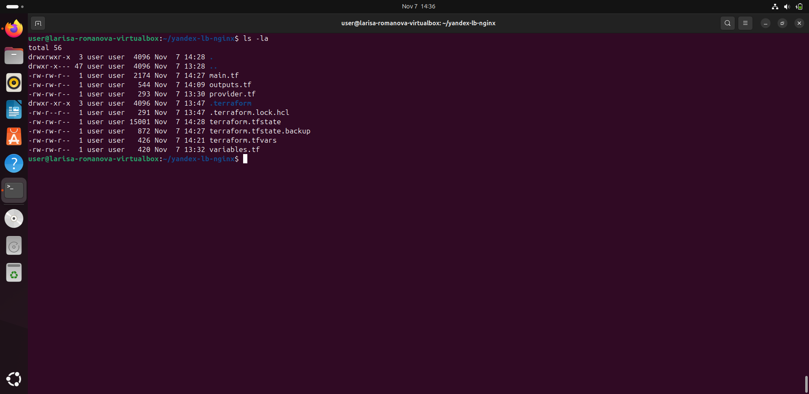
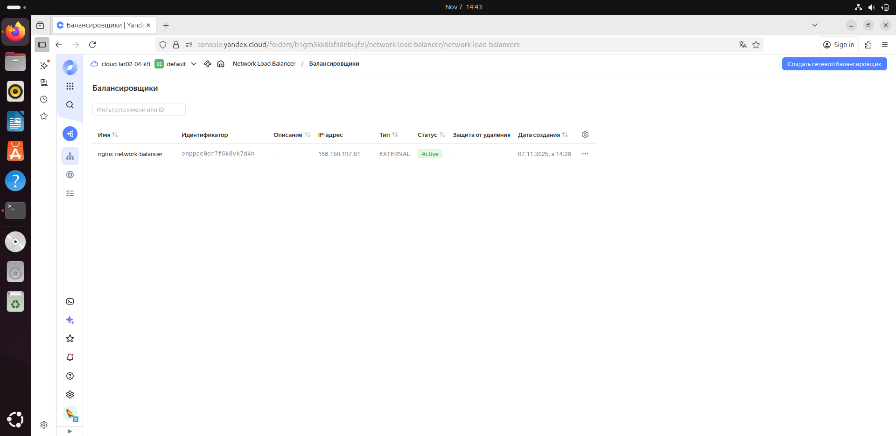
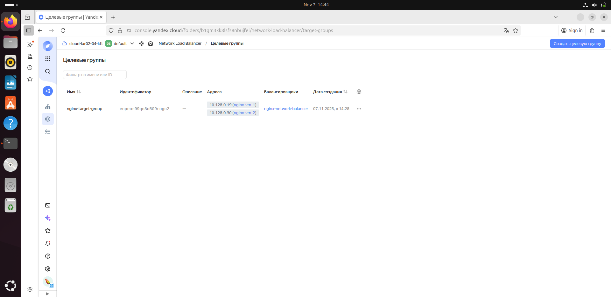
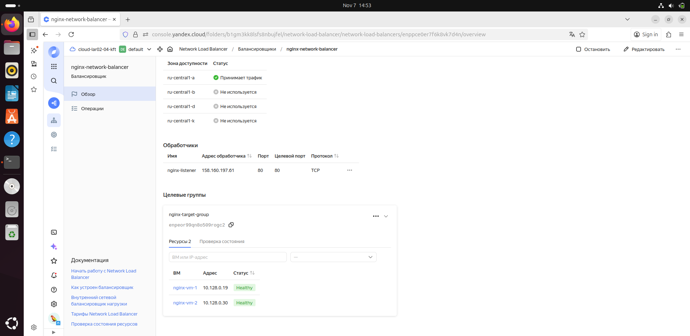
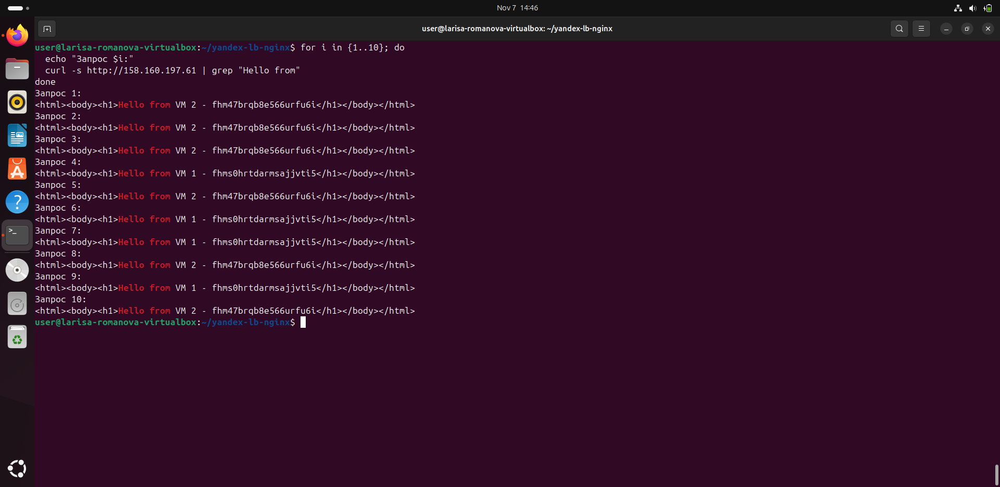

# Задание выполнила Лариса Романова

## Описание задания

Данный Terraform проект создает инфраструктуру в Yandex Cloud, включающую:

### Основные требования:
1. **Создать 2 идентичные виртуальные машины** с использованием аргумента `count`
2. **Создать таргет-группу** и поместить в неё созданные виртуальные машины
3. **Создать сетевой балансировщик нагрузки**, который:
   - Слушает на порту 80
   - Отправляет трафик на порт 80 виртуальных машин
   - Выполняет HTTP healthcheck на порт 80 виртуальных машин

### Дополнительные задачи:
- Установить на виртуальные машины пакет Nginx и запустить веб-сервер на порту 80
- Проверить в веб-консоли Yandex Cloud:
  - Балансировщик в статусе **Active**
  - Обе ВМ в целевой группе в состоянии **Healthy**
- Выполнить запрос на 80 порт внешнего IP-адреса балансировщика и убедиться в получении ответа от Nginx

## Архитектура решения
```
Internet
↓
Load Balancer (158.160.197.61:80)
↓
Target Group
├── VM 1 (nginx-vm-1) - 158.160.99.213:80
└── VM 2 (nginx-vm-2) - 158.160.98.112:80
```

## Структура проекта
```
yandex-lb-nginx/
├── main.tf # Основная конфигурация инфраструктуры
├── variables.tf # Переменные
├── provider.tf # Провайдер Yandex Cloud
├── outputs.tf # Выходные значения
├── terraform.tfvars # Значения переменных (токен, идентификаторы)
├── README.md # Этот файл
└── Скриншоты/
├── balancer.png # Балансировщик в статусе Active
├── target.png # Целевая группа
├── healthy-status.png # Статус Health Check
├── balancer-check.png # Проверка работы через браузер
└── Playbook.png # Структура Terraform файлов
```
## Скриншоты для проверки

### 1. Terraform Playbook

*Полный набор Terraform файлов для развертывания инфраструктуры*

### 2. Балансировщик нагрузки в статусе Active

*Сетевой балансировщик `nginx-network-balancer` в статусе **Active***

### 3. Целевая группа с виртуальными машинами

*Целевая группа `nginx-target-group` с двумя ВМ: `nginx-vm-1` и `nginx-vm-2`*

### 4. Health Check статус Healthy

*Обе виртуальные машины в состоянии **Healthy** (прошли проверку работоспособности)*

### 5. Работа Nginx через балансировщик

*Ответ от Nginx при обращении к внешнему IP балансировщика `158.160.197.61`*

## Верификация балансировки нагрузки

```bash
# Проверка распределения запросов между ВМ
for i in {1..10}; do
  echo "Запрос $i:"
  curl -s http://158.160.197.61 | grep "Hello from"
done
```
